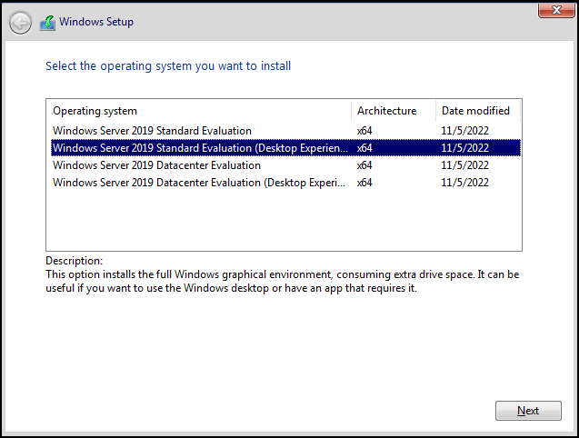
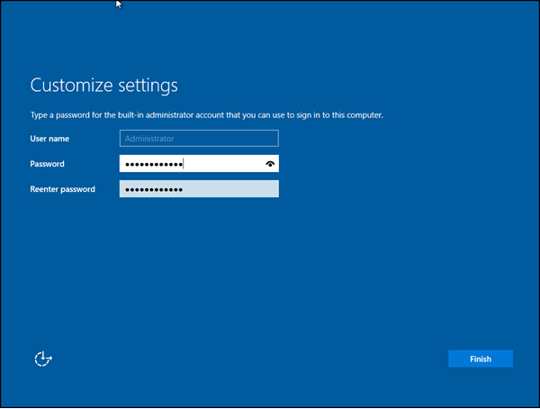
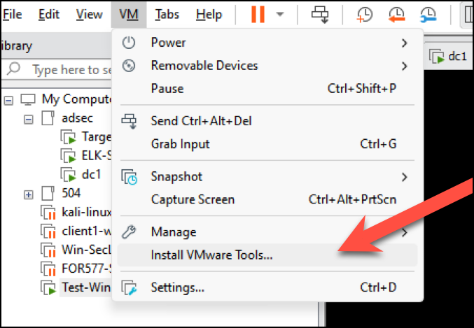
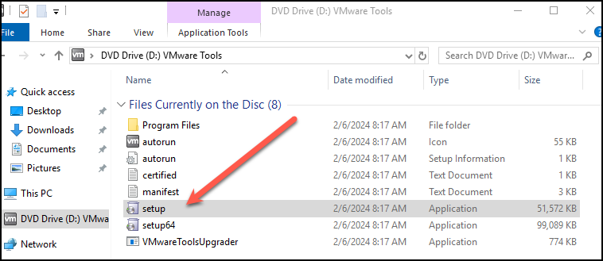
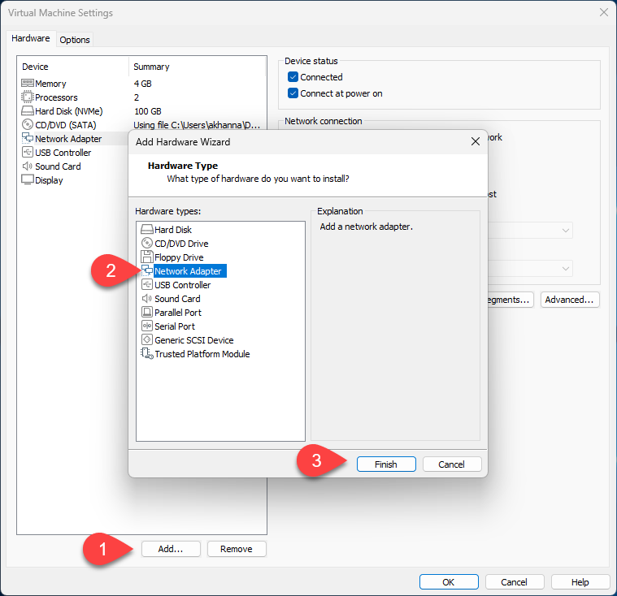
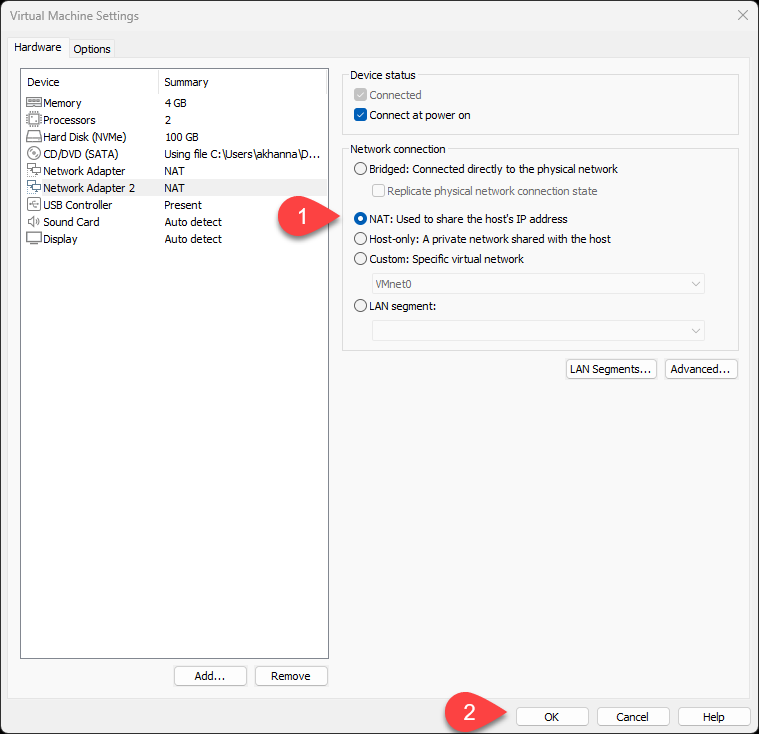
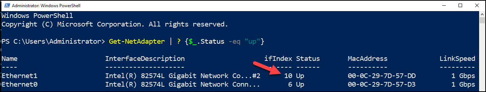

**Welcome to the Active Directory Security Labs**
This blog contains the instructions to set up the Lab infrastructure for the AISACON Workshop
<https://melbourne2024.cyberconference.com.au/workshops/workshop-RQcm3V0zhO>

**If you do not complete this lab, you will not be able to complete the exercises in the course.**  

----
### Introduction 

In this lab we will configure our base operating systems for the infrastructure we will use for the labs. Please note the systems will be configured as part of an Active Directory environment in the next lab using Ansible. 

Following three systems will be needed to complete the labs

1. `adsecvm` - this is a Virtual Machine provided as part of the course content and contains the lab wiki, ansible scripts to create these labs etc
2. `dc1` - this is the domain controller system 
3. `client1` - this is the client system

### Lab Requirements

1. You will need VMware Desktop Hypervisor (Earlier called VMWare Workstation) on your system. VMWare Workstation is free for personal use and is available at [VMWare Desktop Hypervisor](https://www.vmware.com/products/desktop-hypervisor.html). While the installation is not complex, Broadcom does provides a guide for installing the software [VMware Desktop Hypervisor installation Guide](https://knowledge.broadcom.com/external/article/344595/downloading-and-installing-vmware-workst.html) if needed. 

2. You will need the adsecvm zip file downloaded from [ADSEC VM](https://1drv.ms/f/s!AkACbEfrdduxgvZc-gMnQx2oULx4AQ?e=azV9tt) 

3. You will need Windows Operating system media. This can be downloaded from the Microsoft evaluation Center, Microsoft Server software is available for free evaluation for a period of 180days and Clients for 90days, enough time for us to work through these labs.  Windows 2019 Server ISO image can be downloaded from [Windows 2019 ISO](https://info.microsoft.com/ww-landing-windows-server-2019.html). Once the ISO image has been downloaded you can move to the next steps of installing the Operating System. 

4. Windows 11 ISO image for the client system, this can be downloaded from [Windows 11 ISO](https://www.microsoft.com/software-download/windows11) 

### Linux Virtual Machine adsecvm

Download the Virtual machine OVA file from the link  [ADSEC VM](https://1drv.ms/f/s!AkACbEfrdduxgvZc-gMnQx2oULx4AQ?e=azV9tt)

###  dc1

We will configure the Virtual Machine and the Operating System in this lab.
We will promote the system to a Domain Controller and configure the domain in next lab using Ansible.

#### Installing Windows Server system for Domain Controller

Please create a virtual machine (VM) with Windows 2019. We will use the domain name `talespin.local`  *"Greetings and salivations, fellow aviators"*.  

Feel free to refer to the video provided in your course account if you need guidance on how to install Windows 2019 in VMware.

Please choose the desktop experience when you are asked to choose the experience, while installing Windows 2019. The desktop  is not specifically needed to perform day to day operations as all administration can be done using PowerShell, for the lab purposes, it will make it easier for us to look at configuration and understand the Active Directory better.



Please configure the password for `Administrator` account as `Password@123`. This is the hardcoded password in the Ansible config file, if you use any other password please remember to update the Ansible configuration file for the next lab  (We do not recommend using week passwords in production environments).  
It is worth noting that when the system is upgraded to a Domain Controller, this account will be elevated to **the Domain Administrator** account with RID 500 (More about this later).



#### Installing VMWare Tools

Once Windows 2019 Server has been installed, VMware tools can and should be installed. VMWare tools makes it easy to copy paste, resolution management from the host machine to the and generally would make the experience of dealing with the VM better. 



Install the setup file from the DVD Drive.  



You can continue with the typical configuration to install the VMWare tools. Once installed reboot the system. Once the system reboots, login using the `Administrator:Password@123` or the credentials that you created.

#### Configuring the IP addresses
We will provision 2 network cards for this VM so that it can talk to the Internet and to the local VM network at the same time. Both the network cards will be in the NAT mode.

This can be done by going to the VM -> Setting and adding the network card.



Both the network cards should have NAT as the setting. An example is shown below.




Now we will configure static IP address on one network interface. In PowerShell while running with Administrator privileges run the following cmdlet to list all the network interfaces that are enabled.
```
Get-NetAdapter | ? {$_.Status -eq “up”}
```
Sample output of the command. 



Now configure static IP address of one interface to `192.168.100.11/24`. You can use PowerShell to set the IPAddress, based on the Interface Index, in above case it was 10 and 6.You may have a different number. Please chose the lowest interfaceindex for setting this IP Address. For us it is 6 and not 10.

```
New-NetIPAddress -InterfaceIndex 6 -IPAddress 192.168.100.11 -PrefixLength 24  
Set-DnsClientServerAddress -InterfaceIndex 6 -ServerAddresses ('127.0.0.1')
```  

### Client1

Now we will create the base system which will be used as a `client1`, this system will be used as an attacker system and also to perform reconnaissance in the course.

### Create the VM

We will use Windows 2019 virtual machine  as a client machine named `client1`, this machine will also work as our attacker machine. . 
The account configured for the system should be `Administrator` and password as `Password@123`. 

Once you have the VM created. It is a good idea to install VM tools on the system, you can do it similar to how you did it for the `dc1` system.

You can create a base 2019 VM as defined above. 

Now configure static IP address of one interface to `192.168.100.21/24`. You can use PowerShell to set the IPAddress, based on the Interface Index.

The InterfaceIndex can be identified using the following command. 

```
Get-NetAdapter | ? {$_.Status -eq “up”}
```

In my case it was 5.You may have a different number. Please chose the lowest interfaceindex for setting this IP Address. 

```
New-NetIPAddress -InterfaceIndex 7 -IPAddress 192.168.100.21 -PrefixLength 24
Set-DnsClientServerAddress -InterfaceIndex 7 -ServerAddresses ('192.168.100.11', '8.8.8.8')
```
 
You should now have two new virtual machines. 

1. A Windows 2019 server with IP address 192.168.100.11 to be configured as the domain controller. 
2. A Windows 2019 server with IP address 192.168.100.21 to be configured as a client system. 


### Disabling Defender

You **MUST** disable Windows Defender for a smooth install. The best way to accomplish this is through Group Policy.
Tamper Protection must be disabled first, otherwise Group Policy settings are ignored.

1. Open Windows Security (type Windows Security in the search box)
2. Virus & threat protection > Virus & threat protection settings > Manage settings
3. Switch Tamper Protection to Off (you do not need this if using a Server OS)

It is not necessary to change any other setting (Real Time Protection, etc.)

Important! Tamper Protection must be disabled before changing Group Policy settings.

To permanently disable Real Time Protection:

1. Make sure you disabled Tamper Protection
2. Open Local Group Policy Editor (type gpedit in the search box)
3. Computer Configuration > Administrative Templates > Windows Components > Windows Defender Antivirus > Real-time Protection
4. Enable Turn off real-time protection
5. Reboot

Make sure to reboot before making the next change

To permanently disable Microsoft Defender:

1. Make sure you rebooted your machine
2. Open Local Group Policy Editor (type gpedit in the search box)
3. Computer Configuration > Administrative Templates > Windows Components > Windows Defender Antivirus
4. Enable Turn off Windows Defender Antivirus
5. Reboot

Lets move to configuring these systems with their respective roles.  
We will configure the system using Ansible in the next lab. Continue through the next link.
[ADSEC_Workshop Part2]<https://www.rudrasec.io/adsec_workshop1/> 

