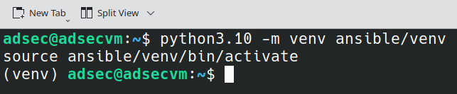
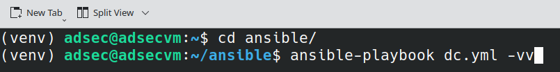

----
### Introduction  

In this lab we will now use Ansible from our Linux `adsecvm` to configure the Windows Systems.  

We will configure two systems

1. `dc1` - this is the domain controller system 
2. `client1` - this is the client system

### Lab Requirements
We will use the `adsecvm` to remotely configure the domain controller as `dc1` and Client system  as `client1`.   You will need the `adsec` vm downloaded from the link to configure the `dc1` and `client1`.

### Preparing the Domain Controller for Ansible  

Please run the following PowerShell command to enable WinRM on the Domain Controller.   
You will need Internet connectivity from the dc1 system to configure this. If you have followed the Lab0A you should have this configured. If you need help please reach out to `support@rudrasec.io`.

```
iwr -useb https://raw.githubusercontent.com/ansible/ansible-documentation/refs/heads/devel/examples/scripts/ConfigureRemotingForAnsible.ps1 | iex 
```

### Running Ansible from adsecvm to configure Domain Controller

Now we can use `adsecvm` to configure the domain controller. The username and password for the adsecvm is `adsec:adsec`

We have created a playbook called `dc.yml` to configure the domain controller. Please note: this will only work if the Windows 2019 system is configured with the right user account ie `Administrator: Password@123`. 

Run the following commands to invoke the Virtualenv to run Ansible on the `adsecvm`. 

```
cd /home/adsec/ansible
python3.10 -m venv ansible/venv 
source ansible/venv/bin/activate
```



No we can run the ansible playbook, we will run the `dc.yml` runbook. 

```
ansible-playbook dc.yml
```



Once Ansible Runbook execution is completed, the Windows 2019 system will be renamed and configured as a domain controller. 

### Preparing the Client system for Ansible  

We can run the following PowerShell command to enable WinRM on the Domain Controller.   
You will need Internet connectivity from the client1 system to configure this.

```
iwr -useb https://raw.githubusercontent.com/ansible/ansible-documentation/refs/heads/devel/examples/scripts/ConfigureRemotingForAnsible.ps1 | iex
```

We need RSAT and .net. Please run the following manually in PowerShell 

```
Add-WindowsCapability -Name Rsat.ActiveDirectory.DS-LDS.Tools~~~~0.0.1.0 -Online
Start-BitsTransfer -Source 'https://go.microsoft.com/fwlink/?linkid=2088631'  -Destination "$Env:Temp\Net4.8.exe"; & "$Env:Temp\Net4.8.exe"
Restart-Computer
```
No we can run the ansible playbook, we will run the `client.yml` runbook. 
From the python virtual environment run the client playbook as we did for domain controller.  

```
cd /home/adsec/ansible
python3.10 -m venv ansible/venv 
source ansible/venv/bin/activate
ansible-playbook client.yml
```  
